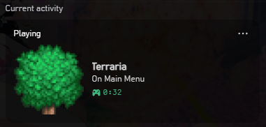
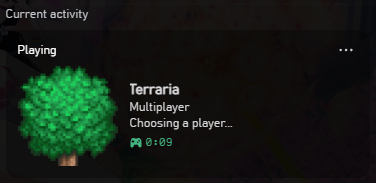
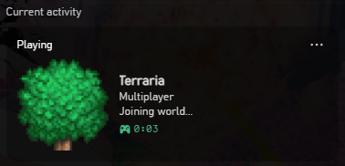
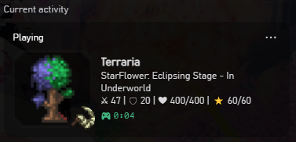
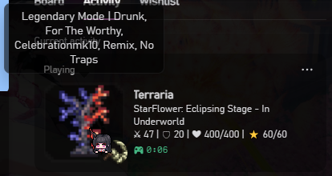
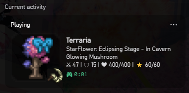
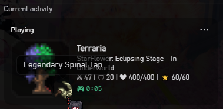

# Terraria-RPC

A feature-rich Discord Rich Presence client for Terraria. It connects to a running Terraria process in real-time by reading its memory (via ClrMD) and displays detailed game information directly on your Discord profile, including current health, mana, defense, equipped items, biome, world size, world difficulty, active seeds, and much more!


## Features

- **Real-Time Memory Scanning:** Directly reads from Terraria's memory structure to get live, accurate data.
- **Customizable Templates:** Use a graphical user interface to format what information is displayed on your Discord status.
- **Headless Mode:** Can be run silently in the background alongside Terraria via game launch parameters.
- **System Tray Support:** Minimizes to the system tray while Terraria is running to stay out of your way.
- **Dynamic Icons & Text:** Automatically detects your biome, special/secret seeds (e.g. Zenith, For The Worthy), active items, and displays relevant visual icons.

## Prerequisites

Nothing! By downloading the **Self-Contained Release**, all necessary .NET runtimes are packaged directly into the application, meaning you don't need to install anything else to run it.

## Downloading

1. Go to the [Releases page](../../releases) on this GitHub repository.
2. Download the latest `TerrariaRPC.exe` from the Assets section.
3. Place the `TerrariaRPC.exe` anywhere on your computer (e.g., in a dedicated `TerrariaRPC` folder, or you can just place it beside Terraria.exe).

## How to Use

### Normal (GUI) Mode

1. Double-click `TerrariaRPC.exe` to launch the configuration GUI.
2. Here you can configure the text that appears on your Discord status using various **Variables**.
3. Click the **"? Available Variables"** button to see a full list of supported placeholders (like `{{PlayerHp}}`, `{{Biome}}`, `{{WorldName}}`, etc.).
4. Launch Terraria.
5. While Terraria is running, you can click the `X` (close) button on the GUI to minimize Terraria-RPC to your system tray. It will run in the background.

### Headless Mode (Launch alongside Terraria)

You can configure Steam (or a Terraria shortcut) to launch Terraria-RPC automatically in the background whenever you play the game!

For Steam:
   1. Open Steam, right-click **Terraria**, and select **Properties**.
   2. Under **General > Launch Options**, add the following command (replacing the path with wherever you extracted the app):

   ```
   "C:\Path\To\TerrariaRPC\TerrariaRPC.exe" --no-gui %command%
   ```
   *(Make sure to use the correct drive letter and folder path where you placed the `.exe`)*

For Shortcuts:
   1. Navigate to your Terraria.exe, right-click and press "Create Shortcut".
   2. Right-click to the shortcut then press "Properties".
   3. On Target field, replace it with the following argument:
      ```
      `C:\Windows\System32\cmd.exe /c start "" [Path\To\TerrariaRPC.exe] --no-gui & start "" [Path\To\Terraria.exe]
      ```
      *Replace \[Path\To\TerrariaRPC.exe\] & \[Path\To\Terraria.exe\] with their correct paths, don't include brackets, obviously...*\
      *To copy your application path, hold left-shift while right-clicking the .exe, then press "Copy as path", replace it to \[Path\To\TerrariaRPC.exe\] or \[Path\To\Terraria.exe\] accordingly.*
      *Terraria need to be in the last argument launch due to it crashing because of UAC prompt from TerrariaRPC.*
      *Icon will change to cmd.exe, just replace it by clicking "Change Icon" and navigate to Terraria.exe and choose it.*
      *How this should look, for example on mine:*
      ```
      C:\Windows\System32\cmd.exe /c start "" "E:\Documents\Llander\GitHub\Terraria-RPC\bin\Publish\TerrariaRPC.exe" --no-gui & start "" "D:\Program Files\Games\Steam\steamapps\common\Terraria\Terraria.exe"
      ```
   4. Then hit **Apply**, that'll now launch both TerrariaRPC and Terraria.

**How Headless Mode works:**
- The app will launch completely hidden in the background when you start Terraria.
- It will automatically wait for Terraria to fully start up.
- Once you close Terraria, Terraria-RPC will automatically detect that the game has closed and will exit itself cleanly.
- If you want to configure your Discord status template while the app is running headlessly, just double-click `TerrariaRPC.exe` from your file explorer. It will detect the hidden instance and bring up the GUI!

## Compiling from Source

If you want to build the project yourself:

1. Install the [.NET 10 SDK](https://dotnet.microsoft.com/download/dotnet).
2. Clone this repository.
3. Open a terminal in the repository root and run:
   ```cmd
   publish.bat
   ```
4. This will compile a self-contained 32-bit application in `bin\Publish`. You can run `TerrariaRPC.exe` from there.

## Why Administrator mode?
Because it needs to read Terraria's memory 🥺 and just giving surface level permission barely scratches it. Also, you can just read the code (if you're nerd or curious) or if you have trust issues, just don't download it. There's no sketchyahh virus in there that'll inject something or somewhat, it just running locally and sending your Terraria's stats/data to jewcord.

*This is also using "agentic codign assist" 🤓, but not in a way like having a "multibillion doolar app" mindset, so I literally carefully curate and orchestrate alongside the build 🤓, if you're against with it just don't use this too 😭 lol...*

## Images







